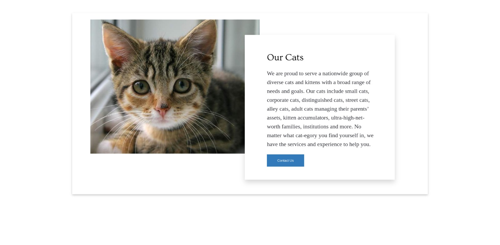

# Mindgruve Styling Assessment

## Final Preview

<!-- add final.jpeg here -->

## How to build

1. Clone this repo
2. On the command line, navigate to this directory.
3. Run `npm i`
4. Run `npm start` this will build and start a watcher via webpack.
5. Visit http://localhost:8080 to see the site.
# styling-assignment
